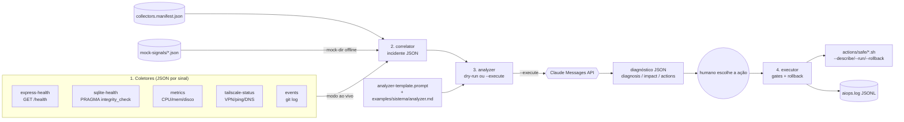

# troubleshootingAIOps

Framework de **troubleshooting assistido por IA** feito de scripts pequenos (Bash + PowerShell)
que encadeiam quatro passos: **coletar sinais → juntar num incidente → pedir diagnóstico ao Claude
→ executar uma ação reversível com humano no loop**. Tudo nasce em **dry-run**: nada chama a API
nem muda estado sem uma flag explícita.

> Estado real (out/2026): a cadeia inteira roda **offline** com dados mock e passa 5/5 no test
> runner. O modo `--execute` (chamar a API de verdade / rodar ações) **nunca foi validado**, e as
> ações do exemplo dependem de endpoints que ainda não existem no Sistema RH.

---

## Para que serve

Quando um sistema dá problema, o trabalho manual costuma ser: entrar na máquina, rodar comandos
soltos, copiar pedaços de log para um chat de IA e montar o contexto na cabeça. Este repositório
transforma isso num fluxo reprodutível:

1. **Coletores** tiram uma "foto" padronizada (JSON) de cada parte do sistema: endpoint `/health`,
   banco SQLite, CPU/memória/disco, VPN Tailscale, commits recentes, linhas de erro de log.
2. O **correlator** junta essas fotos num único JSON de **incidente**.
3. O **analyzer** monta um prompt (template genérico + regras do sistema + incidente) e, se
   autorizado, envia à Messages API do Claude, que devolve diagnóstico, impacto e ações em JSON.
4. O **executor** roda uma ação segura escolhida por um humano, respeitando *gates* (aprovação,
   backup), tentando *rollback* se falhar e registrando tudo num log de auditoria.

O sistema de exemplo é o **Sistema RH** (Express + SQLite acessado via Tailscale).

## Linguagens e dependências

| O quê | Linguagem | Dependências |
|-------|-----------|--------------|
| Todos os scripts | **Bash** (`.sh`) e **PowerShell** (`.ps1`), em pares equivalentes | Bash: `jq` (obrigatório), `curl` (rede), `sqlite3`, `git`, `tailscale` conforme o coletor. PowerShell: nada extra (usa `ConvertFrom-Json`/`Invoke-RestMethod`) |
| Prompt do analyzer | Markdown/texto com tags XML (`framework/analyzer-template.prompt`) | — |
| Dados (sinais, incidentes, golden outputs, manifesto) | JSON | — |
| Modelo de IA | Claude via `POST https://api.anthropic.com/v1/messages` | `ANTHROPIC_API_KEY` (só com `--execute`) |

Não há Python, Node, build, nem pacote a instalar. Os scripts Bash de métricas são Linux-first
(`/proc`); em sistemas sem `/proc` os campos saem `null`.

## Arquitetura



### 1. Coletores

Cada coletor é um script independente que imprime **um JSON** no "envelope padrão"
(`collected_at` epoch, `timestamp` ISO, `source`, e os campos do sinal). Em caso de falha,
imprime `{"status":"error","error":...}` em vez de quebrar.

| Script | Onde | O que coleta |
|--------|------|--------------|
| `health` | `framework/collectors/generic/` | `GET http://HOST/health`; normaliza `status` para `ok`/`degraded`/`down`/`unknown` |
| `metrics` | `framework/collectors/generic/` | CPU % (2 amostras de `/proc/stat`), memória % (`/proc/meminfo`), disco % (`df`). No `.ps1`, via drive letter |
| `logs` | `framework/collectors/generic/` | Últimas N linhas de um arquivo filtradas por `ERROR\|WARN` |
| `events` | `framework/collectors/generic/` | Commits do `git log` na janela (`--since-minutes`) |
| `express-health` | `examples/sistema-rh/collectors/` | `/health` do Express RH: status, uptime, memória, req/min, latência do banco e pool |
| `sqlite-health` | `examples/sistema-rh/collectors/` | `integrity_check`, `journal_mode`, tamanho, latência de `SELECT 1`, idade do backup mais recente |
| `tailscale-status` | `examples/sistema-rh/collectors/` | Estado do Tailscale (`connected`/`offline`/`not_installed`); com `--peer`, ping e DNS |

### 2. Correlator (`framework/correlator.sh` / `.ps1`)

Lido a partir de um **manifesto** (`examples/<sistema>/collectors.manifest.json`) que mapeia cada
*slot* de sinal (`application`, `database`, `system`, `network`, `events`) para:
- o coletor `.sh` e seus argumentos,
- o coletor `.ps1` e seus argumentos,
- um arquivo `mock` usado no modo offline.

Saída: `{ incident: {id, timestamp, window}, symptoms: [], signals: {<slot>: <json do coletor>} }`.
O id é `INC-AAAA-MM-DD-XXX` (3 hex aleatórios); a janela vem de `window_minutes` do manifesto
(default 3). Se um coletor falhar ou não devolver JSON, o slot vira um JSON de erro e o resto
segue. **`symptoms` sai sempre vazio** — derivar sintomas por regra ainda não foi feito.

### 3. Analyzer (`framework/analyzer.sh` / `.ps1`)

Concatena `framework/analyzer-template.prompt` (instruções genéricas: como ler sinais, escala de
confiança, formato de saída, regras de ação, 2 exemplos) + `examples/<sistema>/analyzer.md`
(stack, SLAs e 5 padrões conhecidos do Sistema RH) + o `confidence_threshold` + o incidente.
Monta o corpo da Messages API (`model` default `claude-opus-4-8`, `max_tokens` 8000,
`thinking: adaptive`, `output_config.effort: high`).

- **Padrão (`--dry-run`)**: imprime o prompt e o corpo da requisição; não toca a rede.
- **`--execute`**: exige `ANTHROPIC_API_KEY`, chama a API, extrai o bloco `text` e valida que é
  JSON (sai com código 2 e imprime o bruto se não for).

Contrato de saída esperado: `{ diagnosis{root_cause, confidence, reasoning[], ...}, impact{...},
actions[{priority, action, category, reversible, rollback, requires_approval, ...}], metadata }`.

### 4. Executor (`framework/executor.sh` / `.ps1`)

Executa `examples/<sistema>/actions/safe/<id>.sh`. Cada ação tem três modos:
`--describe` (JSON de metadados), `--run` e `--rollback`.

- **Padrão (dry-run)**: mostra comando, rollback, pré-requisito e gates.
- **`--execute`**: aplica os *gates* lidos do `--describe`:
  `requires_approval` → precisa de `--confirm`; `requires_backup_first` → precisa de
  `--skip-backup` (afirmação de que o backup foi feito); `windows_admin_required` → só aviso.
  Se `--run` falhar, tenta `--rollback`. Cada execução vira uma linha JSON em `aiops.log`
  (ou no caminho de `AIOPS_LOG`). Saída 3 = recusado por gate.

Ações existentes (Sistema RH): `increase-pool` (POST `/api/admin/pool-size`, confere o
resultado no `/health`, rollback volta ao tamanho antigo) e `clear-cache`
(POST `/api/admin/cache/clear`, rollback no-op). Ambas exigem `RH_TOKEN`.

### 5. Test runner (`framework/test-analyzer.sh` / `.ps1`)

Percorre `examples/<sistema>/test-incidents/case-*.json` (5 casos: pool esgotado, VPN caída,
banco corrompido, vazamento de memória, query lenta), cada um com um `*.expected.json` escrito à
mão (golden).
- **Offline (padrão)**: valida fixture e golden como JSON e confere que o analyzer em dry-run
  monta o prompt.
- **`--execute`**: roda o analyzer de verdade e compara **por campo**: `root_cause` presente,
  `confidence` dentro de ±`--threshold` (default 0.15) do golden, categoria da 1ª ação igual, e
  presença de `diagnosis`/`impact`/`actions`.

## Estrutura

```
troubleshootingAIOps/
├── README.md · CLAUDE.md (regras do projeto) · PLANO.md (roadmap e retomada)
├── docs/
│   ├── ARQUITETURA.md   4 pilares (coleta, contexto, análise, ação)
│   ├── NIVEIS.md        níveis 1 (passivo) → 2 (recomendação) → 3 (automação)
│   ├── CASES.md         casos de uso planejados (Sistema RH, FinanWise, TranscritorNPU)
│   ├── CORRELATOR.md · ANALYZER.md · EXECUTOR.md   uso de cada script
├── framework/
│   ├── collectors/generic/   health, metrics, logs, events (.sh + .ps1)
│   ├── correlator.{sh,ps1} + correlator.md (schema do incidente)
│   ├── analyzer.{sh,ps1} + analyzer.md (design) + analyzer-template.prompt
│   ├── executor.{sh,ps1}
│   └── test-analyzer.{sh,ps1}
└── examples/sistema-rh/
    ├── SETUP.md · analyzer.md (prompt especializado)
    ├── collectors.manifest.json · collectors/ (express-health, sqlite-health, tailscale-status)
    ├── mock-signals/        5 saídas de coletor gravadas (modo offline)
    ├── test-incidents/      5 fixtures + 5 golden + README
    └── actions/safe/        increase-pool, clear-cache (.sh + .ps1) + README
```

Só existe o exemplo `sistema-rh`. FinanWise e TranscritorNPU aparecem em `docs/CASES.md` e no
`PLANO.md` como planejados, sem código.

## Como rodar

Tudo abaixo é **offline**: lê arquivos locais, não chama a API, não muda estado.

### Bash (Linux, macOS, Git Bash com `jq` instalado)

```bash
# 1) coletores (mock) -> correlator -> incidente
framework/correlator.sh \
  --manifest examples/sistema-rh/collectors.manifest.json \
  --mock-dir examples/sistema-rh/mock-signals --output /tmp/incident.json

# 2) incidente -> analyzer (dry-run: imprime prompt + request body)
framework/analyzer.sh --incident-file /tmp/incident.json

# 3) executor (dry-run: mostra comando, rollback e gates)
framework/executor.sh --action increase-pool

# 4) test runner offline (esperado: 5 PASS / 0 FAIL)
framework/test-analyzer.sh
```

### PowerShell (Windows, sem dependências)

```powershell
.\framework\correlator.ps1 -Manifest .\examples\sistema-rh\collectors.manifest.json `
  -MockDir .\examples\sistema-rh\mock-signals -Output $env:TEMP\incident.json
.\framework\analyzer.ps1 -IncidentFile $env:TEMP\incident.json
.\framework\executor.ps1 -Action increase-pool
.\framework\test-analyzer.ps1
```

Se a política de execução bloquear: `powershell -ExecutionPolicy Bypass -File .\framework\test-analyzer.ps1`.

### Modo real (opt-in, gasta crédito / muda estado)

```bash
# coletores de verdade (sem --mock-dir): rode na máquina do sistema, com banco.sqlite e backups/ no cwd
framework/correlator.sh --manifest examples/sistema-rh/collectors.manifest.json --output inc.json

export ANTHROPIC_API_KEY=...            # nunca commitar
framework/analyzer.sh --incident-file inc.json --execute --output diag.json

export RH_TOKEN=...                     # token admin do Sistema RH
framework/executor.sh --action increase-pool --execute -- --size 20 --old 10
```

## Limitações conhecidas (lidas no código)

- **`--execute` nunca foi rodado** (analyzer, test runner e executor).
- **Endpoints admin inexistentes**: `increase-pool` e `clear-cache` chamam
  `/api/admin/pool-size` e `/api/admin/cache/clear`, que não existem no Sistema RH ainda.
- Os filtros jq dos `.sh` são validados offline por `tests/jq-filtros.sh` (coletores com
  stubs de curl/sqlite3/tailscale, correlator em mock, analyzer/executor em dry-run), rodado
  no CI (`.github/workflows/check.yml`) junto com `shellcheck`.
- `symptoms` do incidente é sempre `[]`; os casos de teste trazem sintomas escritos à mão.
- `similar_incidents` nos golden outputs são ilustrativos: não há armazenamento de histórico.
- `docs/ARQUITETURA.md`/`NIVEIS.md` descrevem a visão completa (nível 3, aprendizado,
  integrações); o código implementa até o nível 2 em dry-run.

## Glossário

| Termo | Significado aqui |
|-------|------------------|
| **AIOps** | Uso de IA em operações de TI: aqui, o Claude lê sinais e propõe diagnóstico/ação |
| **Sinal (signal)** | JSON produzido por um coletor sobre uma parte do sistema |
| **Slot** | Chave em `signals` do incidente (`application`, `database`, `system`, `network`, `events`) |
| **Coletor (collector)** | Script que produz um sinal |
| **Envelope padrão** | Campos comuns de todo sinal: `collected_at`, `timestamp`, `source` (+ `status:"error"` em falha) |
| **Manifesto** | `collectors.manifest.json`: liga slots a coletores `.sh`/`.ps1` e a arquivos mock |
| **Mock** | Saída de coletor pré-gravada para rodar sem rede |
| **Incidente** | JSON único com `incident`, `symptoms` e `signals`, entrada do analyzer |
| **Janela (window)** | Intervalo de tempo coberto pelo incidente (`window_minutes`) |
| **Correlator** | Script que junta sinais num incidente |
| **Analyzer** | Script que monta o prompt e (opcionalmente) chama o Claude |
| **Template / prompt especializado** | Instruções genéricas (`analyzer-template.prompt`) + regras do sistema (`examples/*/analyzer.md`) |
| **Confidence threshold** | Abaixo dele o modelo deve devolver `actions: []` e pedir mais dados (default 0.70) |
| **Dry-run** | Modo padrão: mostra o que faria, sem rede e sem mudar estado |
| **`--execute`** | Opt-in que chama a API ou roda a ação de verdade |
| **Ação segura (safe action)** | Script reversível em `actions/safe/` com `--describe`/`--run`/`--rollback` |
| **Gate** | Trava do executor: `requires_approval` (`--confirm`), `requires_backup_first` (`--skip-backup`) |
| **Rollback** | Desfazer a ação; o executor tenta automaticamente se `--run` falhar |
| **Audit log** | `aiops.log`: uma linha JSON por execução (`at`, `action`, `result`, `rc`) |
| **Fixture / golden** | Incidente de teste (`case-*.json`) e saída esperada escrita à mão (`*.expected.json`) |
| **Pool (de conexões)** | Conexões de banco reaproveitadas pelo Express; "pool exhausted" = todas ocupadas |
| **WAL** | *Write-Ahead Logging*, `journal_mode` do SQLite |
| **Tailscale** | VPN mesh usada para alcançar o servidor da empresa |
| **MTTR** | *Mean Time To Recovery*, tempo médio até resolver um incidente |
| **Níveis 1/2/3** | Passivo (só coleta/diagnóstico) → recomendação com aprovação → automação de ações reversíveis |
